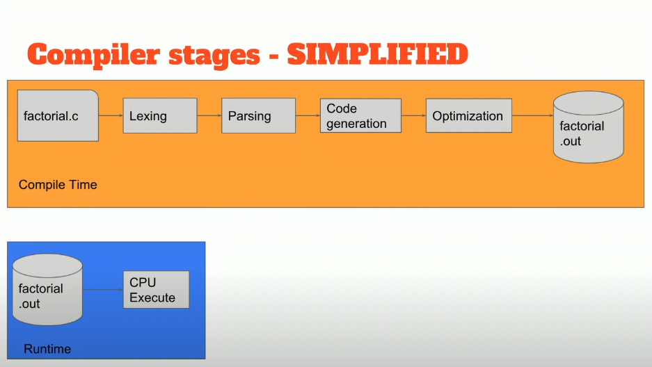
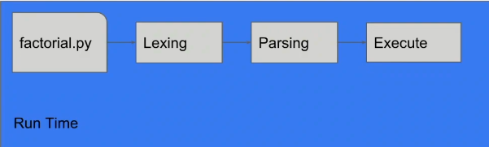
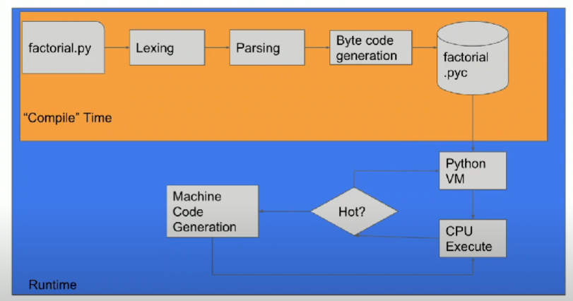

### Vecchie considerazioni
Abbiamo visto che un interprete:
- accetta una frase alla volta
- produce l'AST
- valuta l'AST in modo tale da eseguire la semantica della frase di partenza

Un compilatore invece:
- accetta un intero programma (più frasi)
- produce sempre un unico AST, ma effettivamente composto dai vari AST corrispondenti ad istruzioni/espressioni distinte, nel secondo livello dell'albero
- valuta  i sotto-AST in ordine per riscrivere la frase di partenza in una (o più) frasi in un altro linguaggio (più semplice).
    - da fare eseguire direttamente alla macchina
    - oppure da far sottoporre ad altri passaggi di interpretazione/compilazione

La differenza è sottile, un programma potrebbe essere considerato una frase lunga con dei newline. In generale, un interprete produce direttamente il risultato finale "che ci si aspetta". Un compilatore produce un passaggio intermedio (ad esempio codice assembly). La differenza tuttavia, è nell'occhio di chi osserva, se ci si apetta dell'assembly, anche un compilatore potrebbe essere considerato un interprete.

### Video interessante (https://www.youtube.com/watch?v=sQTOIkOMDIw)

## Compilatori

La compilazione spacca in quanto alla fine del processo ho già il codice macchina ottimizzato, pronto ad eseguire sulla mia CPU.

Tuttavia:
- I compilatori sono difficili da scrivere!
    - In particolare gli stadi di *code generation* e *optimization* (quelli che mancano ad un interprete)
- Si guadagna tempo a *run-time* il che è eccellente ma il **tempo di compilazione** può diventare debilitante per progetti grossi.
- Il binario prodotto da un compilatore è specifico per l'architettura della CPU e per il SO target

## Interpreti (naive)

Un interprete rende tutto il processo di distribuzione e  sviluppo più agile.
- non devo aspettare la compilazione di tutto il progetto (solo l'interpretazione di una istruzione/espressione)
- tutte le macchine con l'interprete installato hanno il runtime per eseguire il codice (portabilità)

Tuttavia, le performance di un programma interpretato in questo modo fanno veramente schifo. Ogni singola istruzione/espressione deve venire *lexata* e *parsata* prima di poter essere eseguita. Inoltre, non avendo accesso al codice macchina su cui si andrà ad eseguire non si possono applicare ottimizzazioni possibili con un compilatore.

## Interpreti con VM e Bytecode

Per i motivi di performance elencati sopra, tipicamente gli interpreti hanno una architettura che sfrutta uno step di compilazione verso un formato intermedio (bytecode) che rappresenta il codice macchina di una macchina virtuale.

In questa maniera l'interprete (o meglio la VM) per eseguire effettivamente una istruzione/espressione non deve anche eseguire gli stadi di lexing e parsing ma devo solo eseguire il bytecode in base a come è fatta la VM (pensa a stack machine come JVM). Inoltre, siccome le istruzioni di una VM sono più astratte e semplici di quelle di una macchina reale, la "compilazione" ha tempi comunque brevi.

In questa maniera le performance sono nettamente migliori rispetto al caso precedente e rimaniamo comunque portabili. Tuttavia, una compilazione AOT ha comunque performance molto migliori. Questo perchè un compilatore può applicare ottimizzazioni non possibili sul bytecode, in particolare la differenza si nota nei (hot) loop. 

## JIT
Possiamo provare a fondere i due approcci. In modo da ottenere:
- portabilità e distributibilità del codice
- agilità nello sviluppo
- performance paragonabili al caso compilato, effettivamente compilando ed ottimizzando le **parti hot** del codice (cicli molto lunghi / funzioni chiamate molte volte) 

La parte di "compilazione" rimane uguale a prima. Adesso però durante l'esecuzione la VM riconosce le parti hot del codice e le esegue, non più interpretando del bytecode, ma traducendole ed ottimizzandole in maniera analoga a come si farebbe con un compilatore.

### JIT tradeoffs
La compilazione JIT è analoga alla compilazione "classica" e quindi ha gli stessi problemi. Utilizzare JIT ha quindi dei tradeoff.

In paricolare JIT causa **delay lunghi iniziali** a runtime mentre si sta applicando JIT alle aree hot. Questo può essere problematico in alcuni casi d'uso:
- one-time scripts, che terminerebbero prima della fine del JIT
- initial renders, non voglio bloccare la pagina dell'utente 