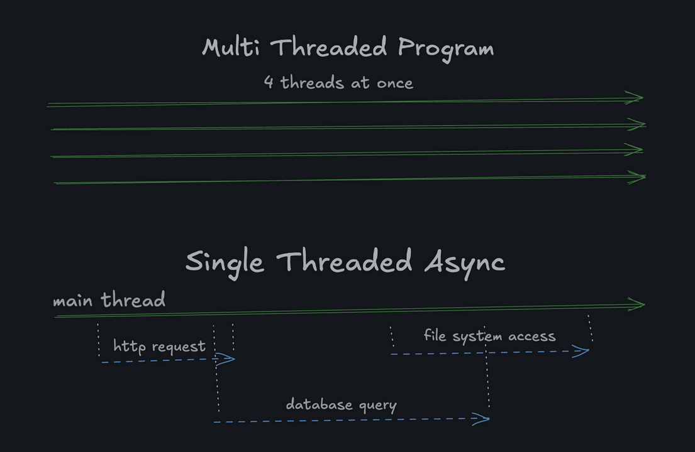

### Single Threaded
JavaScript is famously single-threaded. You have an octa-core processor? Cool story, bro. Your JavaScript program will only mimic a fraction of that power.

You might be thinking: "Gee, if it’s single-threaded, it must really suck at doing many things at once." But not so fast!

JavaScript is actually incredible when it comes to asynchronous programming. Why? Because it's "non-blocking". Javascript does not do many things at the same time (multiple threads running concurrently), instead it delegates IO-operations to someone else (thread pool of browser/runtime ... idk) while it keeps running. As the delegated io-operations complete, js gets notified and can handle the results without having waited for them

The simplest way to think about it is that JavaScript can only execute one instruction at a time, but it can continue processing other stuff while it's waiting for something **external** (IO) to complete. In other words, if the "many things" you're doing are I/O bound, like:
- Network requests
- File system operations
- Timers
- Database queries

Then JavaScript performs quite well. If they're CPU bound (like heavy calculations), JavaScript will struggle. A Node.js server will often far outperform a multi-threaded Python, Ruby, or PHP server because of its ability to handle many concurrent connections without much overhead. On the other hand, it will usually be outperformed by a multi-threaded Java, Go, C++, or Rust server when it comes to heavy computation.
