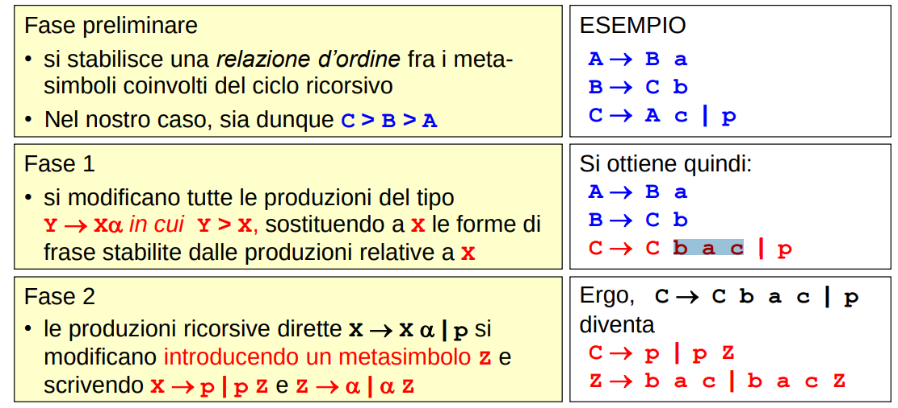

### BNF & EBNF
Simile alla notazione per descrivere grammatiche usata fino ad adesso:
- per le regole di produzione ::= al posto di ->
- per i metasimboli <...> al posto di lettera maiuscola

inoltre, con la versione estesa EBNF:
- *X ::= [a]B* per indicare una ripetizione da 0 a 1 volta  (opzionale)
    - BNF equivalente: *X ::= B | aB*
- *X ::= {a}^n B* per indicare una ripetizione da 0 a n volta 
    - BNF equivalente: *X ::= B | aB | …| a^nB*
- *X ::= {a}B*  per indicare una ripetizione da 0 a un numero indefinito di volte
    - BNF equivalente -> *X ::= B | aX* -> questa è ricorsiva a destra in quanto vogliamo aggiungere sempre a sinistra, sarebbe ricorsiva a destra per fare il contrario
- *X ::= (a | b) D | c* per raccoglimenti
    - BNF equivalente -> *X ::= a D | b D | c*

## ALBERI DI DERIVAZIONE
Per le sole grammatiche di Tipo 2 (le prime che hanno solo un metasimbolo a sinistra nella produzione) si introduce il concetto di albero di derivazione. Una notazione ad albero per esprimere come una frase è stata derivata da una grammatica di almeno tipo 2.
- ogni nodo dell’albero è associato a un simbolo del vocabolario *V = VT unito VN*
- la radice dell’albero coincide con lo scopo S
- se *a1, a2, ..., ak* sono i k figli ordinati di un dato nodo X (associato al simbolo X di VN), significa che la grammatica contiene la produzione *X ::= A1 A2 ... Ak* dove *Ai* è il simbolo associato al nodo *ai*

**OSS**: notazione esclusiva a tipo 2, perchè queste grammatiche ammettono solo un padre a sinistra. L'albero di derivazione non può esistere per grammatiche di Tipo 1 e 0 perché in esse il lato sinistro delle produzioni ha più di un simbolo e dunque i nodi figli avrebbero più di un padre (ergo non si otterrebbe più un albero, ma un generico grafo) 

**DERIVAZIONI CANONICHE**
Derivazione “left-most” (deriv. canonica sinistra)
- A partire dallo scopo della grammatica, si riscrive sempre il simbolo non-terminale più a sinistra.
Derivazione “right-most (deriv. canonica destra)
- A partire dallo scopo della grammatica, si riscrive sempre il simbolo non-terminale più a destra.

**OSS**: Cercare di costruire l'albero di derivazione data una grammatica e una frase è facile per un essere umano in quanto ci si può far guidare dalla frase e dal ragionamento, le macchine invece hanno piu difficolta...

### AMBIGUITA di una GRAMMATICA
Una grammatica è ambigua se esiste almeno una frase (del relativo linguaggio) che si riesce ad ottenere in più modi applicando in modi diversi le regole della grammatica
- almeno due alberi di derivazione distinti portano alla stessa frase

**es**:
- A ::= A + A
- A ::= a

La frase "a+a+a" è ambigua!

**FONDAMENTALE**: L'ambiguità è il male! Incasina le macchine incrementando l'ordine di complessità degli algoritmi riconoscitori. Questo perchè grammatica ambigue per definizione ammettono molteplici alberi di derivazione di una stessa frase e il riconoscitore li deve calcolare tutti e trovare il più adatto (quello che si mappa meglio al significato della frase, pensa alla associatività delle operazioni e a come si traduce in AST diversi per associatività diverse e conseguente diverso risultato)

**Possiamo accorgerci se una grammatica è ambigua?** Purtroppo, stabilire se una grammatica di Tipo 2 sia ambigua è un **problema indecidibile**
- però, in pratica, un certo numero di derivazioni è spesso sufficiente per "convincersi" della (non per dimostrare la) ambiguità di G

**NB**: Se una grammatica è ambigua, spesso se ne può trovare un'altra equivalente che non lo sia (ma non sempre).

## FORME NORMALI
Un linguaggio di tipo 2 (non vuoto) può essere sempre generato da una grammatica di tipo 2 in cui:
- ogni simbolo, terminale o non terminale, compare nella derivazione di qualche frase di L
    - ossia, **non esistono simboli o meta-simboli inutili**
- non ci sono produzioni della forma A → B con A,B appartenenti VN
    - ossia, **non esistono produzioni che “cambiano solo nome” a un meta-simbolo**
- se il linguaggio non comprende la stringa vuota allora **non ci sono produzioni della forma _A → epsilon_**.

In particolare si può fare in modo che tutte le produzioni abbiano una forma ben precisa:

**Forma normale di Chomsky**
- produzioni della forma A → BC | a; con *A,B,C* appartenenti *VN*, *a* appartenente *VT unito epsilon*
- weak

**Forma normale di Greibach** (per linguaggi privi di epsilon)  -> goated  
- produzioni della forma *A → a alpha*;  con *A appartenente VN*, *a appartenente VT*, _alpha appartenente VN*_(tutti non terminali)
- **NB**: facilita, come si vedrà, la costruzione di riconoscitori dato che **rende evidente per quale simbolo terminale inizia la produzione**.
- goated. È quella che ci interressa.

### TRASFORMAZIONI
Per facilitare la costruzione dei riconoscitori, è spesso rilevante poter trasformare la struttura delle regole di produzione per renderle più adatte allo scopo. In particolare, le trasformazioni sono utili per arrivare alla forma normale di Greibach.

Alcune trasformazioni particolarmente importanti sono:
- **Sostituzione** 
- **Raccoglimento a fattore comune**
    - Fondamentale! Se non si raccoglie devi scegliere una alternativa a caso e ti puoi sbagliare 
        - ambiguità...
    - La soluzione è guadagnare tempo; intanto ti occupi del primo simbolo, nei passi successivi avrai in ingresso nuovi simboli e saprai decidere senza andare a caso.
        - è un problema di **non determinismo**: adesso con le informazioni che hai non sai prendere un scelta certa...
        - Soluzione: aspetta e recupera nuove informazioni per fare una scelta certa.
- **Eliminazine della ricorsione sinistra**
    - sempre possibile, ma **cambia l'ordine di derivazione** dato che cambia le regole della grammatica.
    - cambiare l'ordine di derivazione ha conseguenze nella successiva valutazione della frase. A volte non ce lo si può permettere di farlo...

OSS: Le prime due regole sono analoghe a quelle dell'algebra, l'ultima è meno banale (Vedi dopo).

**IL PROBLEMA DELLA RICORSIONE SINISTRA**
Perchè è desiderabile eliminare la ricorsione sinistra?

    X → X a c | p

**La ricorsione sinistra nasconde l’iniziale delle frasi prodotte**, che si può determinare solo guardando altre regole. Nell’esempio sopra, tutte le frasi iniziano per p, ma questo non si vede dalla regola ricorsiva.

Non è così nella ricorsione destra, che invece evidenzia proprio l’iniziale delle produzioni:

    X → p | p Z
    Z → a c | a c Z

La buona notizia è che, tecnicamente, si può sempre sostituire la ricorsione sinistra con una destra (vedi sopra). La cattiva notizia è che spesso non ci potremo permettere il lusso di farlo, a causa delle conseguenze accennate di sopra.

Più nel dettaglio, potremmo **non** voler eliminare la ricorsione sinistra dato che: sostituendo la ricorsione sinistra con una destra, si generano le stesse frasi, ma mediante produzioni e passi diversi.
- Ergo, se interessa solo il risultato finale «ai morsetti», rimpiazzare la ricorsione sinistra con una destra è lecito e privo di conseguenze
- se, invece, interessa anche come ci si è arrivati (ossia, la sequenza di derivazione), allora il rimpiazzo non è lecito perché cambiando le regole cambia anche la sequenza di derivazione.

In un puro riconoscitore, che deve solo dire «sì o no», eliminare la ricorsione sinistra è fattibile senza conseguenze. In un vero parser, che deve anche dare significato alle frasi (lecite), regole diverse tipicamente implicano significato diverso per alcune frasi, con ciò alterano il liguaggio.
- e.g. associatività delle operazioni aritmetiche

**Trasformazione in forma normale di Greibach**:
Sostituzione:
- espando un metasimbolo con la parte destra della sua produzione; **utile per rendere evidenti le ricorsioni sinistre**

Raccoglimento a fattore comune:
- raccolgo il prefisso più lungo comune a due produzioni ed eventualmente riscrivo il resto in una regola a parte

Eliminazione della ricorsione sinistra:
- l'idea è esplicitare con cosa inizia la frase in una prima regola senza ricorsione
- per poi usare un altra regola di appoggio che, tramite ricorsione destra, mi aggiunge quante volte voglio la parte che si ripeteva anche prima 

## PUMPING LEMMA, COME CAPIRE SE UN LINGUAGGIO è DI TIPO 2/3 o MENO? 
Rispondiamo ora alla domanda riguardante: "se, trovata una grammatica che descrive il linguaggio desiderato, esista o meno una grammatica più semplice ... e magari trovarla", nel sottocaso dei linguaggi di tipo 2 e di tipo 3 (quelli che ci interessano)

Capire se un **linguaggio** (non grammatica) è di Tipo 2 (o di Tipo 3) "solo guardandolo" in generale non è banale.
- Se hai la grammatica è facile, basta controllare il numero e la posizione dei metasimboli.
- Tuttavia, **di solito si parte dal LINGUAGGIO desiderato, non dalla grammatica** e solo successivamente si prova a definire una grammatica che lo genera.

A questo punto molte domande 
- la grammatica è semplice/corretta/ambigua?
- ma in primo luogo, posso capire la tipologia del linguaggio ancora prima di definire la grammatica?
    - sarebbe molto comodo se la risposta fosse si in quanto in questo modo potrei subito cercare di scrivere la grammatica più stringente possibile (riconoscibile dalla macchina più economica possibile) senza vagare alla cieca tentando magari di fare qualcosa di impossibile (scrivere una grammatica di tipo 3 per un linguaggio di tipo 2)
    
### PUMPING LEMMA
Il pumping lemma dà una **condizione NECESSARIA, ma non sufficiente, perché un LINGUAGGIO (non grammatica) sia di Tipo 2** (o 3)
- Essendo solo una condizione necessaria, può essere usato per dimostrare "in negativo" che un linguaggio non è di Tipo 2 (o non è di Tipo 3)
- ... ma purtroppo non per affermarlo "in positivo"
    - se pumping lemma: false -> linguaggio non è di tipo 2 (o 3)
    - se pumping lemma: true  -> linguaggio potrebbe essere di tipo 2 (o 3), ma non è detto

**Idea**:
- in un linguaggio infinito, ogni stringa sufficientemente lunga deve avere una parte che si ripete (regola ricorsiva).
- ergo, essa può essere "pompata" un qualunque numero di volte ottenendo sempre altre stringhe del linguaggio.

La formulazione è leggermente diversa a seconda che si tratti di linguaggi di Tipo 2 o 3, ma la sostanza non cambia.
- nei linguaggi di tipo 2, la stringa ha questa forma: z = uvwxy; con v e x sottoparti pompabili    
    - u(v^i)w(x^i)y    appartenente al linguaggio
    - caratteristica dei tipi 2 è il self embedding e quindi ho due cose che crescono assieme
    - u e y sono il prefisso e suffisso della parte pompabile 
- nei linguaggi di tipo 3, la stringa ha questa forma: z = xyw; con y sottoparte pompabile          
    - x(y^i)W          appartenente al linguaggio
    - caratteristica dei tipi 3 è la linearità destra/sinistra; di conseguenza, c'è una crescita di una sola cosa
    - x e w sono il prefisso e suffisso della parte pompabile 

**DOMANDA DI DENTI**: come si fa a trovare la grammatica adatta per un linguaggio?
Una prima analisi è possibile applicando il pumping lemma. Possiamo capire se il linguaggio desiderato NON è di tipo 3 e successivamente se NON è di tipo 2.
