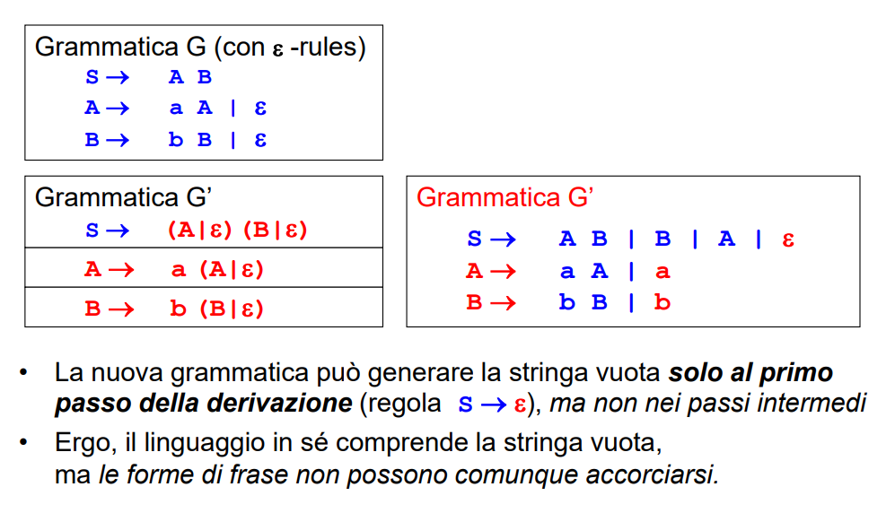

## Definizione Grammatica
Una Grammatica è una notazione formale con cui esprimere in modo rigoroso la sintassi di un linguaggio. 
- **un linguaggio** (sottoinsieme della chiusura del suo alfabeto) **si specifica con una grammatica**

Una grammatica è una quadrupla <VT,VN,P,S> dove:
- VT è un insieme finito di simboli terminali (elementi dell'alfabeto)
- VN è un insieme finito di simboli non terminali
    - I simboli non terminali sono dei meta-simboli che servono a scrivere le regole di produzione
- P è un insieme finito di produzioni
    - regole di riscrittura a −> b dove a e b sono stringhe: a appartenente V+, b appartenente V*
    - ogni regola esprime una trasformazione lecita che permette di scrivere, nel contesto di una frase data, una stringa b al posto di un’altra stringa a.
- S è un particolare simbolo non-terminale detto simbolo iniziale o scopo della grammatica.

**NB**: Gli insiemi VT e VN devono essere disgiunti: VT intersecato VN = 0. L’unione di VT e VN si dice vocabolario della grammatica.

**Nomenclatura**:
- FORMA DI FRASE(SENTENTIAL FORM) = frase in divenire
    - una qualsiasi stringa comprendente sia simboli terminali sia meta-simboli, ottenibile dallo scopo applicando una o più regole di produzione.
- FRASE = frase finale
    - una forma di frase comprendente solo simboli terminali.
- SEQUENZA DI DERIVAZIONE (freccia spessa)
    - la sequenza di passi che producono una forma di frase sigma dallo scopo S.
    - una sequenza di derivazione può essere:
        - diretta (freccia senza niente): una sola applicazione di una regola, un solo passo
        - con +: uno o più applicazioni di produzioni
        - con *: zero o più passi

### Linguaggi generati da una grammatica
Data una grammatica G, si definisce il Linguaggio L_G generato da G come l’insieme delle frasi:
- derivabili dal simbolo iniziale S
- applicando le produzioni P

### Grammatiche equivalenti
Una grammatica G1 è equivalente a una grammatica G2 se generano lo stesso linguaggio.
- una grammatica potrebbe però essere preferibile a un’altra ad essa equivalente dal punto di vista dell’analisi sintattica
- se riesco ad esprimere il mio linguaggio con un tipo 3 è molto meglio rispetto ad una grammatica equivalente di tipo 2 

Purtroppo però, in GENERALE, stabilire se una grammatica è equivalente ad un'altra è un problema indecidibile.
- le faccenda cambia se ci si restringe a tipi particolari di grammatiche, aventi regole di produzione "sufficientemente semplici"

**Equivalenza del risultato prodotto ma non nel costo di produzione**: Grammatiche di diversa struttura comportano linguaggi con diverse proprietà e implicano automi di diversa “potenza computazionale” per riconoscere tali linguaggi. Per questo motivo è importante scegliere la grammatica equivalente "più economica" per descrivere il linguaggio desiderato.


## CLASSIFICAZIONE DI CHOMSKY
Le grammatiche sono classificate in 4 tipi in base alla struttura delle produzioni. In ordine di complessità decrescente, abbiamo:

**Tipo 0**: nessuna restrizione sulle produzioni
- In particolare, le regole possono specificare riscritture che accorciano la forma di frase corrente.
- Regole del tipo: G → epsilon che fanno svanire un simbolo non terminale

**Tipo 1 | dipendenti dal contesto**: produzioni vincolate alla forma: *"beta" A "delta"* → *"beta" "alpha" "delta"*. **con *alpha* != *epsilon***
- *A* può essere sostituita da *alpha* solo nel contesto *"beta" A "delta"* 
    - **regole chirurgiche**
- Le riscritture non ACCORCIANO MAI la forma di frase corrente
    -  Una definizione ALTERNATIVA EQUIVALENTE prevede infatti produzioni della forma: *alpha → beta* con |beta| >= |alpha|
- si può trasformare un metasimbolo per volta (A), lasciando intatto ciò che gli sta intorno

**NB**: questo tipo di grammatica **prevede anche vicoli ciechi/rami morti**, ovvero strade in cui non ci sono più regole applicabili. Questo non succede mai nel Tipo 2 e nel Tipo 3

**Tipo 2 | libere dal contesto**: produzioni vincolate alla forma: *A → alpha*; (con alpha che può anche essere epsilon)
- Qui *A* può sempre essere sostituita da *alpha*, indipendentemente dal contesto (non esiste più l'idea stessa di contesto).
    - regole a grana grossa, ogni volta che vedo il metasimbolo sostituisco
- *alpha* può contenere più metasimboli in qualsiasi posizione
- **NB**: non c'è più il vincolo *alpha* != *epsilon*. **Si ritorna a poter accorciare le frasi**, cosa? Qua me lo posso permettere perchè esiste un teorema che mi permette di tirar via gli *epsilon* ottenendo una grammatica equivalente sempre di tipo 2 (vedi dopo). 
- **CASO PARTICOLARE**: se *alpha* ha la forma di *u*, oppure *u B v*, con *u* e *v* appartenenti a _VT*_ (solo sequenze di terminali), la **grammatica si dice lineare**

**Tipo 3 | grammatiche regolari**: produzioni vincolate alle forme lineari destre/sinistre
- lineare a destra 
    - *A → delta*
    - *A → delta B*
- lineare a sinistra
    - *A → delta*
    - *A → B delta*
- le frasi crescono da una parte sola. 
    - è possibile avere un singolo metasimbolo a destra o a sinistra (*delta* è composta da terminali) 
- non posso costruire frasi che crescono contemporaneamente in più punti
**NB**: IMPORTANTE:  produzioni o tutte lineari a destra, o tutte lineari a sinistra - non mischiate.
**NB**: anche qui alpha può essere epsilon.

### Relazione gerarchica
Le grammatiche sono in relazione gerarchica:
- una grammatica regolare (Tipo 3) è un caso particolare di grammatica context-free (Tipo 2),
- che a sua volta è un caso particolare di grammatica context-dependent (Tipo 1),
- che a sua volta è - ovviamente - un caso particolare di grammatica qualsiasi (Tipo 0).

**OSS**: poiché le grammatiche di tipo 2 (e quindi di tipo 3) possono generare la stringa vuota *epsilon*, la relazione di inclusione vale solo se si conviene di estendere le grammatiche di tipo 1 anche la produzione *S → epsilon*.

### CLASSIFICAZIONE DI CHOMSKY IL PROBLEMA DELLA STRINGA VUOTA
Nella classificazione di Chomsky, Le grammatiche di Tipo 1 non ammettono la stringa vuota nel lato destro delle produzioni. Viceversa, le grammatiche di Tipo 2 e 3 la ammettono. Come è possibile che le grammatiche siano in relazione gerarchica tra loro, ma al contempo la stringa vuota non sia ammessa nel Tipo 1 e sia invece ammessa nei Tipi 2 e 3? Sembrerebbe esserci una evidente contraddizione. 

L'assenza di contraddizione è dovuta al seguente teorema

**TEOREMA STRINGA VUOTA**
Le produzioni di grammatiche di Tipo 2 (e quindi anche 3) **possono sempre essere riscritte in modo da evitare la stringa vuota**. Al più, possono contenere la regola *S → epsilon*. 

Il teorema assicura che la sola differenza fra una grammatica context-free con o senza epsilon-rules è che il linguaggio generato dalla prima include la stringa vuota. 

**OSS**: I linguaggi di programmazione (tipo 2) hanno spesso produzioni che ammettono la stringa vuota, di solito per **descrivere parti opzionali** (e.g. le keyword: public, static, void, ecc.). Il teorema ci garantisce che le grammatiche dei linguaggi di tipo 2 di questo tipo potrebbero essere riscritte in una grammatica equivalente senza epsilon-rules mantenendo in questa maniera la relazioni di inclusione. Tuttavia diventerebbe più difficile comprendere le produzioni e quindi spesso si preferisce non eliminare quest'ultime. In sostanza, **la stringa vuota è utile perchè evita di dover specificare ogni combinazione di keyword quando si hanno delle parti opzionali**. 

**Come ottenere la grammatica equivalente senza *epsilon-rules*?**
Data una grammatica G che contiene epsilon-rules, per generare una grammatica equivalente G', senza epsilon rules, **basta fare delle sostituzioni e semplificazioni**. 




### TIPO DI UNA GRAMMATICA E TIPO DI UN LINGUAGGIO
Poiché le grammatiche sono in relazione gerarchica, può accadere che un linguaggio possa essere generato da più grammatiche (equivalenti), anche di tipo diverso. Non è detto però che la prima grammatica che si trova per generare un dato linguaggio sia necessariamente la migliore (più semplice e meno computazionalmente costosa da riconoscere).

Ora che abbiamo introdotto la classificazione di Chomsky formalizziamo meglio quanto detto sopra parlando di *"Equivalenza del risultato prodotto ma non nel costo di produzione"*. Abbiamo che:
- **Il tipo del linguaggio può non coincidere col tipo della grammatica che lo genera**
    - con tipologia di un linguaggio si intende **il tipo della grammatica più semplice in grado di generarlo**
    - il linguaggio generato potrebbe essere di un tipo più semplice della prima grammatica che si è trovato per descriverlo
    (un linguaggio di Tipo 3 potrebbe in realtà essere generato anche da grammatiche di Tipo 2, Tipo 1, Tipo 0)
- ci si potrebbe chiedere se ci sia un modo generale per capire se, trovata una grammatica che descrive il linguaggio desiderato, esista o meno una grammatica più semplice ... e magari trovarla (risposta dopo, **pumping lemma**)

**TEOREMA STRINGA VUOTA 2**
Dato un linguaggio L di tipo 0, 1, 2, o 3 -> I linguaggi L unito {epsilon} e L - {epsilon} sono dello stesso tipo.
- in sostanza avere la stringa vuota o meno non cambia la tipologia di un linguaggio


## Aspetti caratterizzanti delle varie tipologie di linguaggio
Come accennato di sopra, **nelle grammatiche di Tipo 1 non è garantito che qualunque sequenza di derivazione porti a una frase**
- Può succedere di trovarsi in una strada chiusa, impossibilitati a proseguire perché si arriva ad una forma di frase per cui **non ci sono regole di produzione applicabili**
- Questo non succede mai nel Tipo 2 e nel Tipo 3

è utile quindi poter distinguere agevolmente i vari tipi di linguaggio osservando semplicemente la relativa grammatica in modo da poter subito capire che cosa può o non succedere. Abbiamo che:

### Differenza tra linguaggi di tipo 1 e tipo 2**:
Un linguaggio è sicuramente di tipo 1 se è necessario scambiare qualcosa, questa è la sua caratteristica cruciale dato che lo scambio implica due simboli a sinistra nella produzione; le regole del tipo 2 hanno solamente un unico metasimbolo in quella posizione.
- il Tipo 1 ammette produzioni della forma *sigma A delta → a*;
    - ed in particolare produzioni di scambio: *BC → CB* (più propriamente sarebbero più regole con dei metasimboli di appoggio)
- il Tipo 2: invece ammette solo produzioni della forma *A → a* con cui è impossibile realizzare degli scambi

**Differenza tra linguaggi di tipo 2 e tipo 3**:
La caratterisca che distingue il tipo 2 dal tipo 3 è il **self embedding**.
- Nel Tipo 2, produzioni della forma *A → alpha*; dove a può contenere **più metasimboli, in qualsiasi posizione (in particolare anche in mezzo)**
- Nel Tipo 3, produzioni lineari dove ci può essere **un solo metasimbolo, o in testa o in coda** 
    - *A → delta* o *A → delta B* (a destra) oppure
    - *A → delta* o *A → B delta* (a sinistra)

**OSS**: Nel Tipo 2, i meta-simboli possono trovarsi in mezzo alla forma di frase; nel Tipo 3, no

### SELF EMBEDDING
Una grammatica contiene self-embedding (anche non diretto) quando una o più produzioni hanno la forma: A =>* alpha1 A alpha2 (STESSO metasimbolo in mezzo alla frase) *con alpha1,alpha2 apparteneti a V+*

**IMPORTANTE**: Il ruolo del self-embedding è introdurre una ricorsione in cui si aggiungono contemporaneamente simboli a sinistra e a destra, garantendo di procedere "di pari passo". È essenziale per definire linguaggi le cui frasi devono contenere **simboli bilanciati, come ad esempio le parentesi**.

```
TEOREMA: una grammatica di Tipo 2 che non contenga self-embedding genera un linguaggio REGOLARE.
```

Dunque, è il self-embedding la caratteristica cruciale di una grammatica di Tipo 2, che la differenzia da una di Tipo 3.

Più nel dettaglio il **self-embedding è una condizione sufficiente** affinche una grammatica sia di tipo 2, ovvero:
- Se non c'è self-embedding in nessuna produzione (come dice il teorema) esiste una grammatica equivalente di Tipo 3. Quindi il linguaggio è regolare.
- Non vale necessariamente il viceversa, **una grammatica con self-embedding potrebbe comunque generare un linguaggio regolare**, se il self-embedding è "finto" (ovvero, "disattivato" da altre regole)


## RICONOSCIBILITÀ DEI LINGUAGGI
Riprendendo l'ultimo argomento fatto in teoria della computabilità, abbiamo che: i linguaggi generati da grammatiche di Tipo 0 possono, **in generale**, non essere riconoscibili (decidibili)!
- Non è garantita l'esistenza di una MdT capace di decidere se una frase appartiene o meno al linguaggio
    - non è possibile generare (per ogni linguaggio di tipo 0) l'insieme complementare a quello delle frasi valide del linguaggio

Al contrario, i linguaggi generati da grammatiche di Tipo 1 (e quindi di Tipo 2 e 3) SONO riconoscibili
- Esiste **sempre** una MdT capace di decidere se una frase appartiene o meno al linguaggio
- L'efficienza del processo di riconoscimento, però, è un'altra faccenda…

Per ottenere un riconoscitore efficiente occorre adottare linguaggi generati da (classi speciali di) grammatiche di tipo 2 (quelle di nostro interesse)
- Tutti i linguaggi di programmazione sono infatti context free

Per ottenere particolare efficienza in sotto-parti di uso estremamente frequente (numeri, identificatori, keywords, operatori; tutto ciò che diventa un token), si adottano spesso per esse linguaggi generati da grammatiche di Tipo 3
- l'efficienza si ottiene a causa della natura semplice della grammatica, basta mantenere lo stato corrente e leggere sequenzialmente.
- il riconoscimento di grammatiche di tipo 2 invece richiede ricorsione, uno stack, backtracking (se la grammatica è ambigua(?))

Chi riconosce i diversi tipi di linguaggi?
GRAMMATICHE                 AUTOMI RICONOSCITORI
Tipo 0 ->                   Se L(G) è decidibile, serve una Macchina di Turing
Tipo 1 ->                   Macchina di Turing 
Tipo 2 (context-free) ->    Push-Down Automaton (PDA) (cioè ASF + stack)
Tipo 3 (regolari) ->        Automa a Stati Finiti (ASF)


