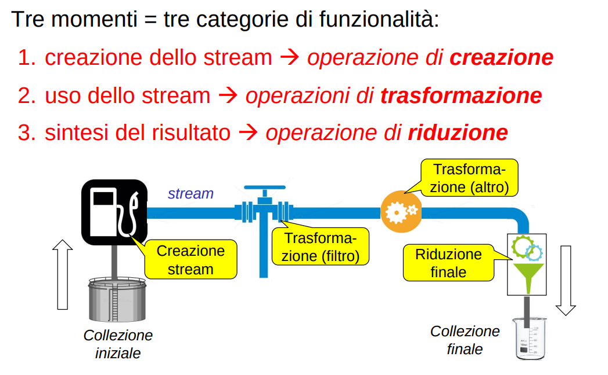

La call-by-name è l’essenza del «pensare in modo lazy»

    Lazyness = computare solo al bisogno, non a priori

Vantaggi:
- **si evita lavoro inutile**
- sintesi e naturalezza nell’esprimere composizione di algoritmi (?)
- possibilità di gestire **flussi/collezioni di dati «idealmente» infiniti**

Quando la «pigrizia» conta:
- in fase di valutazione di funzioni (**call by name**, gia visto)
- in fase di **generazione e gestione di insiemi «infiniti» di dati**
    - molte bello l'esempio della gestione del caricamento dei dati della relazione ciclica utenti-amici
- in fase di **inizializzazione/creazione di oggetti**
    - lazy initialization, si fa solo se l'oggetto viene effettivamente utilizzato (al bisogno)
    - spesso tramite factory, che tipicamente memorizzano anche l’istanza creata (facendo caching)


## ripasso Stream JAVA
Gli stream di operazioni sono l’astrazione (**normali classi** quindi) introdotta da Java per incapsulare il paradigma di programmazione funzionale (o almeno parte di esso)
- Promuovono uno stile in cui si ragiona non più in termini di controllo, ma di come trasformare i dati via via
- Focus su **cosa** si vuole, lasciando sullo sfondo **come** farlo

```
Uno stream di operazioni è un’astrazione per specificare e concatenare operazioni
```
- **non è una collection**
    - non memorizza elementi: usa collection come sorgente e destinazione dei dati 
- **ogni operazione restituisce un nuovo stream** che è il risultato dell’operazione precedente, con i dati «trasformati»
- **svolge le operazioni in modo lazy**
    - non le esegue immediatamente, ma solo quando e se servono
    - non le esegue necessariamente nell’ordine in cui sono scritte (rende facile parallelizzare l'algoritmo)

**tre fasi principali nell'utilizzo di uno stream**:
1. creazione dello stream -> operazione di creazione
    - produce uno stream o a partire da una sorgente esistente (e.g. *listaNomi.Stream()* )
    - o generandone gli elementi uno ad uno (e.g. *rnd.ints(1,100).limit(500)* oppure *Stream.iterate(2, n->n+2)* )
        - in questo caso lo stream è potenzialmente infinito (fondamentale la lazyness altrimenti ciclo infinito)
2. uso dello stream       -> operazioni di trasformazione
    - filtrano, separano, modificano (e.g. paroleStream.filter( p->p.length()>8 ) )
    - restituiscono sempre un altro Stream<Qualcosa>
3. sintesi del risultato  -> operazione di riduzione
    - estrae/computa il «risultato finale» (e.g. *paroleStream.filter( p->p.length()>8 ).count()* oppure *_.collect()* )
    - il risultato non è più uno Stream: è qualcos’altro (collection, oggetto)
    - fatta la riduzione, lo stream è chiuso e non può più essere usato




Gli stream costituiscono un cambio di paradigma e di conseguenza, richiedono un pari cambio di atteggiamento mentale
- occorre pensare non più in termini di controllo
- ma in termini di **come trasformare i dati via via**

**es**: data una collezione di elementi
- identificare tutti quelli che soddisfano certe caratteristiche
- usarli per costruire un altro oggetto di diverso tipo (wrapper)
- e mettere questi ultimi in un insieme ordinato

Approccio classico:
- scorrere gli elementi della collezione                    -> **ciclo for o foreach**
- per ogni elemento, verificare se ha le caratteristiche    -> **if**
- se if positivo, costruire il nuovo oggetto richiesto      -> **new**
- inserire tale nuovo oggetto in un **TreeSet** (preventivamente creato)

Approccio a stream:
- ottenere uno stream di elementi dalla collezione          -> **.stream()**
- filtrare solo gli item con le «giuste» caratteristiche    -> **.filter(…)**
- produrre il risultato mappando il vecchio obj nel nuovo   -> **.map(…)**
- raccogliere i risultati nel «giusto» collector            -> **.toCollection(…)**


### Lazyness nelle collezioni infinite
Gli stream in java sono un idea tipicamente funzionale, ed implementano l'idea di lazyness nella gestione dei dati su cui operano.

In partcolare, **gestiscono collezioni infinite senza problemi** dato che fanno solo il lavoro necessario per rispondere alle richieste dell'ultima operazione nello stream.

Stream.iterate(2, n -> n+2 )       // Collezione infinita lazy, i cui elementi sono generati solo al bisogno
      .peek(System.out::println)
      .filter(x -> x>40)           
      .findFirst();                // L’operazione terminale triggera la richiesta di valori


**NB**: con un approccio eager in cui prima genero tutti i naturali (primo inloopammento) e poi filtro via quelli dispari (secondo inlooppamento) non avrei mai concluso nulla.


### Lazy initialization
Per lazy initialization s’intende la possibilità di **ritardare l’effettiva inizializzazione di una variabile al suo primo uso**
- **Motivo**: efficienza, evitare lavoro inutile (spec. se pesante; pensa a delle richieste di rete tipo query in un DB)

- **OSS**: Potrebbe essere interessante mostrare al prof all'esame l'esempio del caricamento da un DB di un utente senza tutta la lista dei suoi ordini (e senza tutti join degli ordini)

... esempi nei vari linguaggi ...

**Scala**
lazy val age:Int = { println("initializing age"); 42 }  // keyword lazy
println(age)                                            // solo ora age viene inizializzata

**NB**:
La lazy init può sempre essere **simulata tramite il passaggio di opportune lambda** come parametro di inizializzazione

in JS: 

Lazy<int> age = new Lazy<int>( () => {Console.WriteLine("initializing age"); return 42;} );

class Lazy<T> {
    private Optional<T> value;
    private ()->T lazyInitializer;
    
    public Lazy(()->T lazyInitializer){
        this.lazyInitializer = lazyInitializer;
        this.value = Optional.empty();
    }

    public T get() {   // occhio alla thread safety
        synchronized(this) { 
            if (value.isEmpty())
                value = this.lazyInizializer()
        }

        return value.get();
    }

    public boolean isInitialized(){
        return value.isPresent();
    }
} 


### Contesto interessante in cui si può applicare lazyness | allocazione di memoria
The combination of page tables and page faults opens up a wide range of interesting possibilities in addition to COW fork. Another widely-used feature is called **lazy allocation**, which has two parts.

- First, when an application asks for more memory by calling sbrk, the kernel notes the increase in size, but does not allocate physical memory and does not create PTEs for the new range of virtual addresses.

- Second, on a page fault on one of those new addresses, the kernel allocates a page of physical memory and maps it into the page table. Like COW fork, the kernel can implement lazy allocation transparently to applications.

Since applications often ask for more memory than they need, lazy allocation is a win: the kernel doesn’t have to do any work at all for pages that the application never uses. Furthermore, if the application is asking to grow the address space by a lot, then sbrk without lazy allocation is expensive: if an application asks for a gigabyte of memory, the kernel has to allocate and zero 262,144 4kB pages. Lazy allocation allows this cost to be **spread over time**. 
