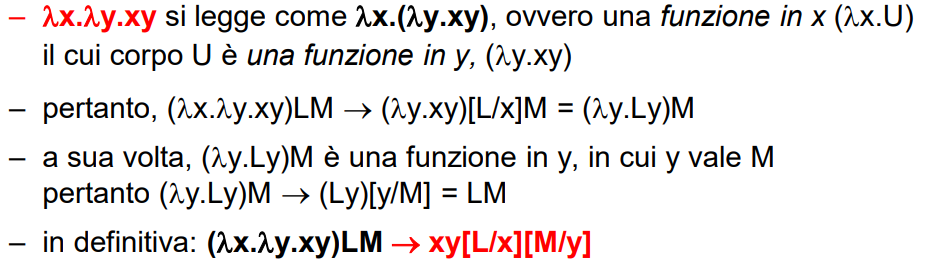

Situazione simile come a quella della macchina di turing. Con quest'ultima si è capito che si può computare qualunque algoritmo (di problemi risolvibili), ma scrivere un algoritmo con la MdT è una follia. 

IDEA: sviluppare il minimo formalismo capace di **descrivere qualunque algoritmo** (Turing-equivalente)
- Un solo concetto: la funzione (con variabili e argomenti che saranno a loro volta funzioni)
- Un solo paradigma: applicazione di funzioni
- Base fondazionale per tutti i linguaggi funzionali e objectoriented del XX secolo

Il lambda calcolo mostra come con solo questi concetti si riesce a fare tutto quello che fa la MdT (per questo è la base dei linguaggi funzionali)

### Lambda termini
L,M,N ::= _lambda_x.L | x | LL

Un lambda-termine può essere:
- **x**, una variabile 
    - '*lambda*' e '.' sono simboli terminali che stanno ad indicare rispettivamente l'inizio di una funzione (senza nome) e il punto di separazione tra firma e corpo della funzione
- ***lambda*_x.L**, una funzione
    - senza nome (chiamata chiusura)
    - con un parametro x (una variabile)
    - e un corpo L, che è a sua volta un lambda-termine
- **LM**, l'applicazione di una funzione
    - L è una funzione
    - M è il parametro attuale (a sua volta un lamda termine) che viene applicato alla funzione (ossia, che prende il posto della variabile sostituita)

**OSS**: Interessante, qua **non abbiamo il concetto di costante o di valore**. L'unica cosa costante sono le dichiarazioni di funzioni (che non sono riducibili), e quindi si utilizzano sempre quest'ultime per definire costanti e/o risultati (vedi booleani di church). 

### Sintassi e semantica
L ::= _lambda_x.L | x | LL
- sintassi (i 3 lambda termini)

(_lambda_x.L_b )L_a → L_b[L_a/x]    
- semantica dell'applicazione di funzione (ricerca e sostituzione nel corpo)
- Dentro a L_b si sostituisce ogni occorrenza di x con L_a

**OSSERVAZIONE EPICA**: Il Lamba Calcolo computa tramite **RICERCA E SOSTITUZIONE DI TESTO**. ***Riducendo*** una alla volta funzioni applicata a funzioni, Church ha dimostrato che questi strumenti **formano un sistema Turing-equivalente**.

**esempi di riduzione**: 
- x è chiaramente non riducibile
- _lambda_x.x è pure non riducibile
- (_lambda_x.x)y si riduce a y
- (_lambda_x.xx)(_lambda_y.(_lambda_z.yz)) si riduce a (_lambda_y.(_lambda_z.yz))(_lambda_y.(_lambda_z.yz))
    - in quanto (_lambda_x.xx) duplica il suo parametro formale x, che qui è il lambda termine (_lambda_y.(_lambda_z.yz)).
- quest'ultimo si riduce a: _lambda_z._lambda_y._lambda_z.yzz (vedi currying sotto) 

**PER ESEMPI CONTORTI**: A volte è utile pensare agli argomenti come stringhe nei primi passaggi. E poi vedere se sono altre funzioni e come applicarle nei passaggi successivi

### Lamba calcolo nei linguaggi mainstream

**CURIOSITà**: Nei linguaggi moderni le lambda expression si chiamano in questo modo perchè derivano da questa teoria.

In tutti i linguaggi main-stream che offrano funzioni come FCE è possibile un mapping diretto fra:
- funzioni del lambda calcolo
- costrutti funzionali offerti dai linguaggi (spesso, proprio nella forma di funzioni anonime – chiamate proprio lambda expressions)

Tali costrutti possono essere:
- definizioni di normali funzioni con nome
- definizioni di funzioni anonime (lambda) assegnate a variabili
 
**MA attenzione al tipo**:
- nel lambda calcolo, funzioni e argomenti sono **untyped**: si lavora per semplici sostituzioni di testo
- nei linguaggi, invece, esiste sempre un **sistema di tipi a cui occorre conformarsi** (più o meno stringente)

**Prima lezione del lamba calcolo**: Per invocare una funzione, darle un nome non è strettamente necessario!

    ((x) => expr)(arg)          equivale a:          (*lambda*_x.expr)(arg)

### Currying
Nel lambda calcolo si dispone solamente di funzioni ad un argomento (mattone elementare) ma nonostante questo non si è limitati. 

Possiamo definire una funzione che **chiude** una funzione di ordine inferiore che mangia il secondo argomento che a sua volta può chiudere un'altra funzione per il terzo argomento ecc.

**Chiaramente è più comodo appiattire i livelli e avere le funzioni a più argomenti, ma il fondamento è questo!**  
- OSS: funzioni espresse in questa maniera si avvicinano di più alle funzioni matematica che si possono **comporre** tra di loro.

Il currying è utile proprio perchè permette di comporre funzioni diverse tra di loro:
- pensa a .filter() di js

Inoltre permette di fissare alcuni argomenti e lasciare variabili altri

