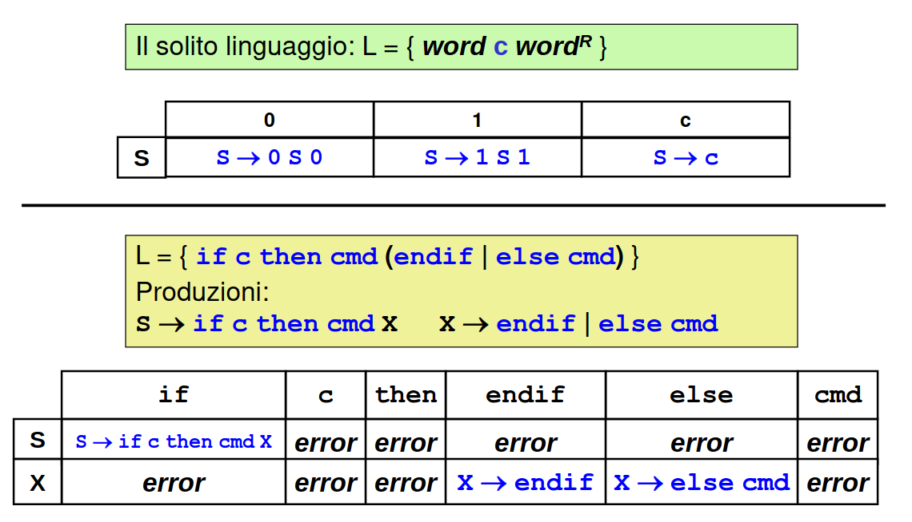

### COME SI IMPLEMENTA UN PDA DETERMINISTICO?
Si può adottare un approccio che manipoli uno __stack__ con la stessa logica di un PDA sfruttando eventuali __costrutti dei linguaggi di programmazione__ che lo facciano per noi.

I linguaggi di programmazione che supportano chiamate
ricorsive di funzioni gestiscono già implicitamente uno stack, possiamo sfruttarlo!

- ogni chiamata di funzione implica l'allocazione sullo stack di un record di attivazione (fase di accumulo).
- quando la funzione termina, il record di attivazione viene
automaticamente deallocato (fase di verifica/decremento).
- ergo, basta mettere i dati da manipolare nelle variabili locali e negli argomenti della funzione, gestendo tutto con furbizia.

__Idea__:

    mapping delle regole delle grammatica del linguaggio deterministico in chiamate (ricorsive) di funzioni!

Il risultato è la tecnica nota come...

## ANALISI RICORSIVA DISCENDENTE (Top-Down Recursive-Descent Parsing)

- si introduce __una funzione per ogni metasimbolo__ della grammatica e la si chiama ogni volta che si incontra quel metasimbolo.
- ogni funzione copre le regole del proprio metasimbolo, ossia riconosce il sotto-linguaggio corrispondente:
    - termina normalmente, o restituisce un segno di successo, se incontra simboli coerenti con le proprie regole
    - abortisce, o restituisce un qualche segno di fallimento, se incontra simboli che non corrispondono alle proprie regole.

### Takeway dall'esempio
- è quasi sempre più comodo che, ad ogni livello, il carattere letto venga passato dal livello superiore piuttosto che fare leggere ad ogni livello il proprio carattere.
- il "main", invocherà la funzione scopo s().

### PARSING TABLE
Applicare l'analisi ricorsiva discendente è un processo meccanico semplice, ma dà luogo a un insieme di funzioni che cablano nel codice il comportamento del PDA.

    Può essere opportuno SEPARARE il motore (invariante rispetto alle regole) dalle regole della specifica grammatica

Si costruisce a questo scopo una TABELLA DI PARSING
- simile alla tabella delle transizioni di un RSF
- ma indica la prossima produzione da applicare
Il motore del parser (parsing engine) svolgerà le singole azioni consultando la tabella di parsing.

FLASH: per creare un linguaggio uso il compilatore del linguaggio stesso per definire una sua nuova versioni espansa

## Limiti dell'analisi ricorsiva discendente
L’analisi ricorsiva discendente non è sempre applicabile. L'approccio funziona solo se non ci sono mai "dubbi" su quale regola
applicare in una qualsiasi situazione.  -> determinismo

    Ciò suggerisce di identificare una classe ristretta di grammatiche context-free, che garantisca il determinismo dell’analisi sintattica discendente.

### Come rendere deterministica l'analisi ricorsiva discendente?
Bisogna mettersi nelle condizioni di poter dedurre la mossa giusta dalle informazioni "disponibili", senza dover mai tirare a indovinare.

Cosa si intende per "informazioni disponibili"?
-  sicuramente, le regole che abbiamo usato fin lì e soprattutto i simboli di input che abbiamo letto e consumato fin lì
    - IL PASSATO
- spesso, però, la mera conoscenza del passato non basta, si ipotizza perciò di poter __"vedere avanti" di k simboli__ (solitamente 1), ossia di poter "sbirciare" l'input ancora da leggere
    - __UN OCCHIO SUL FUTURO PROSSIMO__

## GRAMMATICHE LL(k)
Si definiscono grammatiche LL(k) quelle che sono __analizzabili in modo deterministico__:
- procedendo Left to right
- applicando la Left-most derivation (derivazione canonica sinistra)
- guardando avanti di al più k simboli

Rivestono particolare interesse le GRAMMATICHE LL(1). quelle in cui basta guardare avanti di un solo simbolo per poter operare in modo deterministico.

    In sostanza, se una grammatica è LL(k), è sempre possibile scegliere con certezza la produzione da usare per procedere, guardando avanti al più di k simboli sull'input.

.png)

__NB__: Serve un contratto chiaro su chi legge l'input e quando lo fa.
- IPOTESI: ogni funzione trova nella variabile globale ch il prossimo
carattere da analizzare, già letto ma non ancora analizzato
- Ergo, ogni funzione, prima di ritornare, effettua una lettura da input a beneficio di chi verrà dopo di lei
-  il main effettua la prima lettura prima di invocare la funzione di top-level
- tocca al main stabilire cosa fare quando la funzione di top-level ritorna: si pretende che ch==EOF/EOLN, o va bene qualunque carattere?

### Il ruolo del main al ritorno della funzione di top-level
Questione di fondo: la frase in input deve essere completa? Ossia, non ci deve essere nient'altro dopo?
- allora, ch al ritorno di S() deve contenere EOF o EOLN o altro terminatore

O può essere solo una parte? Nel qual caso può esserci altro dopo, che però non ci interessa
- allora, ch al ritorno di S() può contenere qualunque cosa (significa che probabilmente S() non vede davvero tutto il linguaggio…)