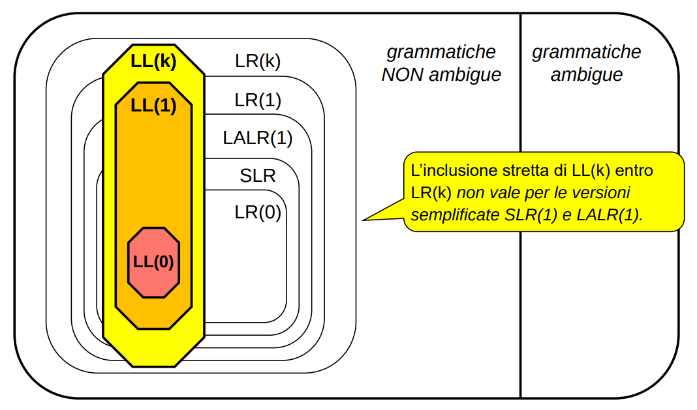

## PARSING LR vs PARSING LL
La debolezza dell'analisi LL sta nella sua semplicità. Costruendo l’albero di derivazione __top-down__, deve poter identificare la produzione giusta da usare avendo visto solo i primi k simboli della parte destra della produzione.

L'analisi LR invece __costruisce l’albero bottom-up__
- Parte dalle foglie, ma aspetta di saperne abbastanza per decidere dove metterle 
    - costruisce i nodi padre bottom-up, a colpo sicuro (deterministicamente)
- Meno naturale dell'analisi LL, ma superiore dal punto di vista teorico
    - **NB: il parser LR è la macchina più potente per grammatiche di tipo 2!**
    - Ogni grammatica LL(k) è anche LR(k)

Abbiamo quindi la seguente relazione insiemistica tra i linguaggi riconoscibili con LR e LL:


Sfortunatamente, **l'analisi LR è complessa da progettare**. Già il caso LR(1), si rivela spesso ingestibile per le grammatiche dei tipici linguaggi di programmazione. Per questo sono state sviluppate **tecniche semplificate** che riducono la complessità:
- **SLR** (Simple LR)
- **LALR(1)** (Look-Ahead LR)

Anche con LR si fa comunque sempre uso di **strumenti automatici** per la generazione del parser. La costruzione manuale è per casi «giocattolo», a fini didattici.


## Tecniche LR
L'analisi LL opera **TOP DOWN**:
- parte dal simbolo iniziale S, poi scende cercando di coprire la frase

Viceversa, l'analisi LR opera **BOTTOM UP**:
- parte dalla frase da riconoscere e cerca di ridurla allo scopo S

A tal fine, a ogni passaggio, bisogna decidere se:
- proseguire la lettura dall'input, senza fare altro        → __SHIFT__ 
- oppure costruire un pezzo di albero senza leggere input   → __REDUCE__

**NB**: Per prendere queste decisioni (shift o reduce) sono necessarie __informazioni di CONTESTO__.

Il parser LR richiede (concettualmente) la presenza al suo interno di un __ORACOLO__. Un componente che, in base al **contesto corrente**, gli dica in ogni istante se:
- proseguire la lettura dall'input, senza fare altro → SHIFT
- o costruire un pezzo di albero senza leggere input → REDUCE

Dunque, un parser LR è costituito da:
- un **oracolo**, che gli dice se fare SHIFT o REDUCE
- uno **stack** (d'altronde i linguaggi di tipo 2 si riconoscono con un PDA) in cui conservare lo stato corrente (input letto/ridotto corrente)
- un **controller** "orchestratore" che fa le domande all'oracolo ed applica i shift/reduce suggeriti dall'oracolo sullo stack.

__NB__: La sequenza di riduzioni non è casuale, è una __derivazione canonica destra usata a rovescio__(bottom-up), per risalire dalla frase allo scopo. Per questo LR.

**come fa l’oracolo a suggerire sempre la mossa giusta da fare?** 

L'oracolo è un __RICONOSCITORE DI CONTESTI__
- si calcolano le informazioni di contesto di ogni produzione
    - ogni produzione ha quindi un contesto associato che la identifica (simile agli Start Set dell'analisi LL)
- l'oracolo riconosce il contesto attuale e in base a ciò risponde SHIFT o REDUCE
- quando riconosce un contesto di riduzione, ordina la REDUCE giusta per costruire a **colpo sicuro** quel certo pezzo di albero


## ANALISI LR(0)
L'idea di contesto di una produzione è ancora fumosa, chiariamo le idee con un esempio. Analisi LR(0)!

Nell’analisi LL siamo partiti dal caso LL(1):
- LL(0) non l'abbiamo neanche considerato: significa poter scegliere la mossa giusta da fare senza dover mai neanche guardare il prossimo simbolo di input
- Possibile solo se **non ci sono mai alternative nelle regole**

Nell'analisi LR conviene invece studiare prima LR(0):
- LR(0) significa che è possibile scegliere la mossa giusta da fare senza dover mai guardare il prossimo simbolo di input
- in LR, però, ciò non significa non avere informazioni in assoluto
    - significa non averle sul futuro [ossia sul prossimo simbolo in input]
    - ma l'informazione di contesto (stringa letta fino a quel momento, che non c'è in LL) permette alla macchina di sapere comunque qualcosa sul passato


Passi:
1. Calcolare il contesto LR(0) di ciascuna produzione 
    - Somigliano agli start set dell'analisi LL
    - ognuno può comprendere **infinite stringhe di terminali e non-terminali** (infatti, anche i contesti vengono descritti con una grammatica per giunta regolare; vedi sotto)
2. Ci sono collisioni fra contesti di produzioni diverse ?
    - **COLLISIONE**: quando una stringa appartenente a un contesto è un **prefisso proprio** di una stringa di un altro contesto
    - **PREFISSO PROPRIO**: una stringa è prefisso di un’altra e ciò che segue è un **terminale** (non un metasimbolo)
3. Se non ci sono collisioni, si possono usare i contesti LR(0) per guidare l’analisi
    - shifto finche la mia stringa in input non combacia con il contesto di una delle mie produzioni
    - applico la riduzione relativa alla produzione che ha combaciato alla mia stringa di input
    - ripeti finchè non raggiungi S (bottom-up)
    - la grammatica è LR(0)
4. se sfortunatamente ci fossero collisioni, i contesti LR(0) non basterebbero per avere un parser deterministico 
    - tentare con LR(1)

### Analisi LR(0) | caso critico:
Il calcolo dei contesti può dare un’informazione fuorviante se lo **scopo è riusato nella parte destra di qualche produzione**.

S → S a     contesto LR(0): { Sa }
S → a       contesto LR(0): { a }

Apparentemente i contesti LR(0) sono diversi. Tuttavia, il problema è che, potendo S comparire anche in forme di frase intermedie, «ridursi a S» non è più sinonimo di «aver sicuramente finito la frase» (è uno stato finale con un arco uscente etichettato da un terminale)

supponiamo di dover riconoscere la frase "aaa".
- Senza produzione di top level Z → S, la prima mossa è sicuramente una riduzione di *a* a *S*, ma poi non è chiaro se l’analisi debba terminare o meno:
    - se non ci fossero altre *a*, ci si è già ridotti allo scopo S
    - se invece la stringa continuasse con ulteriori a, occorrerebbe applicare ulteriori riduzioni da *S a* ad *S*
    - ma per sapere se la stringa è finita occorre guardare avanti di un simbolo e questo significa che la grammatica non è LR(0).

**Aggiungere la produzione di top level Z → S risolve l’ambiguità, perché «aver finito» significa ora «ridursi a Z**

Z → S       contesto LR(0): { S }
S → S a     contesto LR(0): { Sa }
S → a       contesto LR(0): { a }

si vede chiaramente che i primi **due contesti collidono**, perché S è un prefisso proprio di S a.


### CALCOLO DEI CONTESTI LR(0)
Il calcolo dei contesti LR(0) si basa sul fatto che essi sono **definiti da un'opportuna grammatica**.

Proprietà essenziale:
```
la grammatica che definisce i contesti LR(0) è sempre REGOLARE a sinistra
```

Conseguenze:
- **il riconoscimento del contesto corrente può essere svolto da un automa a stati finiti**
- INCREDIBILE: il "potentissimo oracolo" è un semplice automa a stati finiti!
    - continua a shiftare finche non riconosce la stringa corrente come un contesto valido
    - a quel punto ordina la riduzione corretta  
   
Per ottenere il riconoscitore dei contesti (oracolo), ci sono **due vie**:
1. Strada formale:
    - definire in modo formale cosa sia il contesto
    - calcolarlo per ogni produzione
    - infine progettare il RSF che riconosca le frasi di tali contesti
2. Strada pragmatica: 
    - definire in modo formale cosa sia il contesto, ma poi ...
    - applicare un procedimento operativo "pratico" per costruirli iterativamente 
        - evita l'oneroso doppio passaggio dal calcolo dei contesti al design dell'RSF


### Riconoscitore dei contesti | strada formale

**Definizione di contesto LR(0)**:
A parole, il contesto LR(0) della produzione *A → alpha* è **l'insieme di tutti i prefissi (*beta alpha*)** di una forma di frase che usi la produzione *A → alpha* all'ultimo passo (*beta A w => beta alpha w*) di una derivazione canonica destra.

**OSS**:
tutte le stringhe del contesto LR(0) della produzione *A → alpha* hanno la forma *beta alpha* e __differiscono solo per il prefisso *beta* che dipende solo da *A*__
- Il metasimbolo riscritto nella produzione è quindi l'elemento centrale per il calcolo del contesto LR(0) 

**CONSEGUENZA**: si può esprimere il contesto LR(0) come concatenazione fra l’insieme dei *beta* e il suffisso *alpha*
- L’insieme dei *beta* si chiama **contesto sinistro di A**.
- *LR(0)ctx(A → alpha) = leftctx(A) • {alpha}* ;        
    - con *leftctx(A)* == tutte le forme di frase *beta* che possono precedere il non-terminale *A* in **qualsiasi sequenza di derivazione**. 

**Conclusione**:
Cosa mi rappresenta un contesto? 
- l'applicazione di una produzione mi riscrive un metasimbolo *A* in una forma di frase *alpha*
- Grazie al concetto di contesto sinistro, io posso calcolare la forma di frase *beta* che precede *A* in qualsiasi sequenza di derivazione
- dopo l'applicazione della produzione *A -> alpha*, la forma di frase *beta* che precedeva *A* prima della produzione rimane invariata
- A questo punto, se nella mia stringa corrente di input trovo una forma di frase che riconosco essere composta come *beta* *alpha*, sono sicuro di poter ridurre alpha indietro ad A siccome è preceduto dal suo contesto sinistro *beta*
    - (chiaramente per poter essere sicuro della riduzione non ci devono essere due metasimboli con lo stesso contesto sinistro, altrimenti non saprei a quale dei due ridurre (determinismo))

Per calcolare il contesto LR(0) di una produzione è quindi sufficiente calcolare il contesto sinistro del metasimbolo. Ma come si fa questo?

**CALCOLO DEI CONTESTI SINISTRI**:
Determinare leftctx(A) implica **investigare tutti i modi in cui *A* può apparire in una forma di frase**:

1. Poiché lo scopo Z **per definizione** non compare mai nella parte destra di alcuna produzione -> **leftctx(Z) = { epsilon }**
2. Data una produzione *B → gamma A sigma*
    - i prefissi che possono esserci davanti ad A sono quelli che potevano esserci davanti a B seguiti dalla stringa *gamma*
    - quindi, un **primo contributo** a *leftctx(A)* è *leftctx(B)* • {gamma} ovvero, in formule, **_leftctx(A) contiene leftctx(B) • {gamma}_**
    - si parla di un primo contributo perché **altri contributi potranno emergere analizzando le altre regole di produzione**
    - nel complesso, **leftctx(A) si ottiene perciò unendo tutti i contributi di tutte le produzioni in cui A compaia nella parte destra**

**NB**: il calcolo dei contesti sinistri è un **procedimento ricorsivo** in cui Z rappresenta il caso base.

Applicando le due regole ad una grammatica, **si ottiene una seconda grammatica, regolare!** In cui:
- l'**unione** di due contesti sinistri si traduce in un'alternativa ('|')
- la **concatenazione** si traduce in una forma di frase composta dai due leftcontext 

**NB**: I simboli (sia terminali che non) della grammatica originale sono i simboli terminali di questa grammatica. I metasimboli di questa grammatica sono i leftcontext dei metasimboli della grammatica precedente.

**RSF per il riconoscimenti dei contesti**
- Trovata la grammatica regolare che mi descrive i **contesti sinistri** di ogni produzione
- e concatenando i contesti sinistri con i **rispettivi suffissi** (*LR(0)ctx(A → alpha) = leftctx(A) • {alpha}* )
- ottengo una serie di linguaggi regolari che mi descrivono i contesti LR(0) di ogni produzione della mia grammatica

**NB**: A questo punto, l'oracolo si ottiene costruendo l'RSF che riconosce l'unione di tutti i linguaggi regolari che descrivono i contesti ottenuti sopra. **Se questo RSF risulta deterministico** (ossia fra i contesti LR(0) non ci sono conflitti), posso applicare analisi LR(0) e riconoscere il mio linguaggio di tipo due. Altrimenti no.

**DOMANDA**: Non si potrebbe applicare il teorema del martello? (ritornaci sopra)

Questo RSF viene chiamato **macchina caratteristica** della grammatica iniziale:
- **ogni stato finale è etichettato** con la produzione che il parser deve usare per fare una REDUCE in questo contesto.
- **Si riparte ogni volta dallo stato iniziale** e si percorre l'ASF per sapere in ogni momento che mossa fare.
    - se non si è in uno stato finale

**OSS**: la macchina caratteristica è deterministica se:
- ogni stato finale è etichettato da una sola produzione (assenza di conflitti)
- nessuno stato finale ha archi uscenti etichettati da simboli **terminali** (non determinismo nel decidere se ridurre subito o meno, pensa all'esempio con S che si risolve introducendo Z)

### IL PARSING LR(0) ALL’OPERA
L’analisi LR(0) di una frase si svolge sottoponendo all’automa caratteristico la **forma di frase corrente**:
- **SHIFT**: quando l’automa caratteristico raggiunge uno **stato non finale**, segno che le informazioni disponibili non consentono ancora di decidere una riduzione.
    - In questo caso, si legge nuovo input.
- **REDUCE**: quando l’automa caratteristico raggiunge uno stato finale e quindi si applica quella produzione per effettuare un passo di riduzione.
    - In questo caso, non si legge alcun input – è una pura rielaborazione della forma di frase a uso interno.
    - Dopo ogni riduzione l’automa ricomincia dall’inizio.

In realtà, **ricominciare dall'inizio è una inefficienza** poiché la forma di frase cambia solo in fondo (è uno stack!)
- Si può quindi ottimizzare il processo **ricordando il percorso fatto**, così da ripartire dall'**ultimo "stato utile"** e non sempre da capo.
- A tale fine conviene predisporre uno **stack ausiliario degli stati**, in cui impilare i vari stati attraversati (push), disimpilandone tanti quanti i simboli coinvolti in un passo di riduzione.
    - si evita così anche di dover rileggere i primi simboli della stringa di input che non sono stati ridotti

Operativamente, la forma di frase corrente è mantenuta su uno stack (non sorprende: è pur sempre un PDA!)
- SHIFT: pone in cima allo stack il nuovo simbolo terminale letto
- REDUCE: toglie dallo stack tanti elementi quanti corrispondono alla parte destra della riduzione da applicare, poi pone in cima allo stack il simbolo non-terminale corrispondente alla parte sinistra di tale riduzione.

Quando si pone sullo stack lo scopo S, la frase è accettata → spesso si evita di farlo, distinguendo l’ultima reduce in accept


## Condizione sufficiente per analisi LR(0) di una grammatica
Dunque, in sintesi, quand'è che una grammatica è analizzabile mediante analisi LR(0) ?

Condizione sufficiente perché una grammatica sia LR(0) è che ogni __stato (finale) di riduzione__ dell'automa ausiliario sia etichettato da una
__produzione unica__ e non abbia __archi di uscita etichettati da terminali__ (etichettati da non terminale andrebbe bene perchè immagino corrisponderebbe ad un prefisso non proprio?).

A quanto pare questo non corrisponde al 100% con una condizione di determinismo sull'automa caratteristico.

**Teorema bonus che centra con la condizione ma non so perchè**: una grammatica LR(0) non è mai ambigua.


## Strada pragmatica
l’automa caratteristico può essere ottenuto senza calcolare esplicitamente né i contesti sinistri né i contesti LR(0)

Idea base:
- **non calcoliamo i contesti**, per poi dover sintetizzare l'automa
- piuttosto, partiamo dalla regola di top-level Z → S$ e analizziamo via via le situazioni che si presentano
    - scriviamo ogni situazione in un diverso rettangolo ("LR item")
    - quando una regola ne usa un'altra, la includiamo nel rettangolo
    - introduciamo l'**astrazione cursore** "." per indicare "dove siamo" all'interno di ogni regola
- studiamo le evoluzioni possibili di ogni "rettangolo"
    - costruiamo direttamente l'automa dal basso, caso per caso

Più chiaro con un esempio:

// impossibile riportarlo


### tabella di parsing LR
Ogni cella contiene l'indicazione dell'azione da compiere fra le quattro possibili (shift, goto, reduce, accept) nonché le indicazioni accessorie necessarie.

Solitamente si adotta la notazione:
- s / 5: per dire “shift (legge input) e vai nello stato 5”
- g / 5: per dire “vai nello stato 5 (consuma un metasimbolo)”
- r / 4: per dire “riduci usando la produzione n° 4” (e termina)
- a:     per dire “accetta” (e termina)