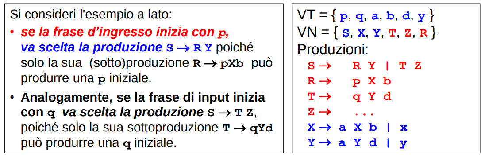
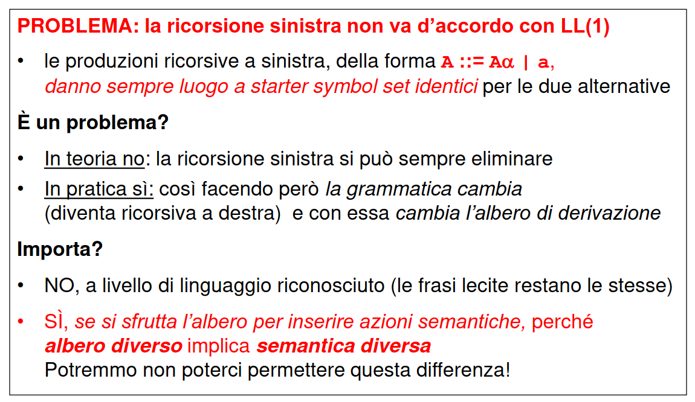

Fino ad adesso, per l'implementazione del PDA, avevamo chiare dalle regole della grammatica il simbolo iniziale della frase. A volte però queste iniziali non sono sempre disponibili fin da subito ma sono __nascoste da dei simboli NON terminali__. In questi casi bisogna andare ad esplorare considerando più produzioni fino a capire l'iniziale per un determinato metasimbolo.



Questo porta a generalizzare il concetto di “simbolo iniziale”.

## Starter Symbol Set 
Lo Starter Symbols set della riscrittura *alpha* è l’insieme dei **simboli terminali iniziali** che si riescono a trovare applicando * produzioni ad *alpha*.

In sostanza, gli starter symbols sono le **iniziali di una forma di frase *alpha*, ricavate anche applicando più produzioni**

**Insieme dei First**
Esiste anche un insieme analogo chiamato insieme __First__ che si ottiene con una definizione alternativa che sfrutta un troncamento al primo carattere. Questo insieme denota le stesse iniziali rispetto ad uno starter symbol set ma **può considerare anche derivazioni del tipo _alpha => epsilon_** per gestire anche i casi in cui una produzione può portare alla stringa vuota **restituendo quest'ultima**.


**Ricorda**: è comodo, per esprimere parti opzionali di un linguaggio, avere produzioni nei linguaggi di tipo 2 in cui le forme di frase si accorciano, o addirittura (come in questo caso) si annullano. C'è sempre il teorema che ci dice che grammatiche di questo tipo possono essere riscritte in una forma con al più la regola *S -> epsilon*.

__OSS__: nei casi in cui la grammatica contenga delle riscritture in cui il meta-simbolo iniziale può scomparire, **non bisogna limitarsi a guardare il primo non terminale** (si deve cercare nel non terminale successivo per trovare l'iniziale).


### Generalizzazione per la definizione di grammatiche LL(1)
Se __prima__ affermavamo che le parti destre delle produzioni relative a uno **stesso meta-simbolo** dovevano iniziare tutte con  __simboli TERMINALI distinti__ affinchè la grammatica potesse essere LL(1). Ora generalizziamo l'idea affermando che le parti destre relative a produzioni di uno stesso meta-simbolo debbano essere caratterizzate da __starter symbol set distinti__.

**Condizione NECESSARIA perché una grammatica sia LL(1)**
```
gli starter symbols set relativi alle riscritture di uno STESSO metasimbolo devono essere disgiunti per ogni produzione.
```

__NB__: la condizione diventa anche __sufficiente__ se nessun metasimbolo, **usato come iniziale all'interno di una riscrittura**, genera la stringa vuota (vedi dopo).

**Riassumendo**: la nuova definizione di grammatica LL(1) è una grammatica in cui tutte le riscritture relative ad uno stesso metasimbolo hanno starter-symbol-sets distinti, e deve valere una delle seguenti: 
- nessun metasimbolo genera la stringa vuota
- oppure, si considera l'iniziale del non terminale successivo a quello che si è annullato (vedi dopo)


... vari esempi, guarda le slide...


## Perché la stringa vuota fa differenza?
- se una produzione genera la stringa vuota, quel meta-simbolo in realtà sparisce quando viene sostituito in un'altra regola
- ergo, regole che sembrano iniziare con un certo metasimbolo in realtà iniziano col successivo e questo va messo in conto

### Come risolvere l'incertezza causata dalla stringa vuota e capire se una grammatica è LL(1)?
Una possibile soluzione è eliminare la stringa vuota, agendo per sostituzione (come è sempre possibile fare per grammatiche di tipo 2)
- questo però risulta in una grammatica più complicata
- inoltre, può generare delle grammatiche che non sembrano LL(1) ma con dei raccoglimenti intellingenti lo diventano (sostanzialmente LL(1))

### Grammatiche sostanzialmente LL(1)
Grammatiche come questa vengono definite **sostanzialmente LL(1)**:

S → A B | B
**A → a A | a**;    conflitto!
B → b B | c

questo perchè possono essere riscritte in questo modo con una nuova **produzione di raccoglimento**:

S → A B | B
A → a X
X → a X | epsilon;  
B → b B | c

X è annullabile! Questo però non causa problemi in quanto non è mai un simbolo iniziale e quindi non può mai nascondere una iniziale appartenente ad un altro metasimbolo. **La grammatica perciò è comunque LL(1)!** 

Un altro esempio di grammatica sostanzialmente LL(1) è:

S → a S b | a S c       => che diventa =>       S → a S X | epsilon
                                                X → b | c


### C’è una via più rapida per capire se una grammatica è LL(1) senza dover eliminare le epsilon-rules?
Sì, mettendo in conto a priori l’effetto delle eventuali epsilon-rules
- 1ª possibilità: agire sulla Parsing Table 
    - come: formalizzando il concetto di **blocco annullabile** e integrando nella tabella l'informazione sulle stringhe che possono scomparire
- 2ª possibilità: ampliare la nozione di Starter Symbols set
    - come: estendendo la nozione di Starter Symbol set verso la più completa nozione di **Director Symbols set (o Look-Ahead set)**


### PARSING TABLE CON BLOCCHI ANNULLABILI
IDEA: costruire la Parsing Table tenendo conto delle epsilon-rules

__DEF | Blocco annullabile__: una stringa (di non terminali) che può degenerare in epsilon

IL PUNTO:
- in presenza di blocchi annullabili, un metasimbolo che non sembrava iniziale può trovarsi "di fatto" a inizio frase
- per tenere conto delle epsilon-rules bisogna quindi considerare anche **i simboli che possono seguire quelli annullabili** 
    - __insieme FOLLOW__ (verrà utilizzato anche dopo)


### DIRECTOR (Lookahead) SYMBOL SET 
Gli starter set sono una definizione troppo semplicistica che mi obbliga a complicare la grammatica eliminando le epsilon rules. C'è bisogno di una definizione aggiuntiva.

Per tenere conto delle epsilon-rules bisogna considerare anche i simboli che possono seguire quelli annullabili 
- **insieme FOLLOW**

Possiamo integrare quest'ultimo con lo starter-symbol-set in un nuovo insieme caratterizzante:
- identico allo Starter-Symbols-set quando non c'è la stringa vuota..
- … ma integrato dal nuovo insieme FOLLOW quando qualche produzione genera la stringa vuota (e quindi blocchi annullabili)

Definiamo quindi il **director symbol set** come **l'unione di questi due insiemi**.


**CONDIZIONE LL(1) CON DIRECTOR SYMBOLS SET**
```
    Condizione NECESSARIA E SUFFICIENTE perché una grammatica sia LL(1) è che i Director Symbols set relativi a produzioni alternative di uno stesso metasimbolo siano disgiunti.
```

... Flash: esistono algoritmi che ti calcono i simboli di follow


// cambiamo argomento


### Il problema della ricorsione sinistra


Ricorda: la ricorsione sinistra può in teoria sempre essere sostituita con una ricorsione destra ottenendo un linguaggio equivalente, tuttavia questa trasformazione cambia l'ordine di derivazione e questo **influenza l'analisi sematica** (ricorda sempre il caso dell'associatività delle operazioni).

## Riconoscibilità efficiente dei linguaggi context-free | Se la grammatica non è LL(1) che cosa si fa?
Abbiamo visto che grammatiche apparentemente NON LL(1) in realtà se elaborate lo possono diventare mantenendo l'equivalenza (sostanzialmente LL(1)). Se la grammatica non è LL(1) si potrebbe provare quindi a trasformarla in modo da renderla riconoscibile mediante analisi ricorsiva discendente.

Varie strategie:
- si può cercare di riorganizzarla con sostituzioni, raccoglimenti, etc.
- oppure, si può cercare di modificare qualche regola "fastidiosa"
- oppure ancora, si può passare al caso LL(k), con k>1
    - le definizioni di FIRST, FOLLOW, etc. si estendono facilmente al caso LL(k) con k>1 → FIRSTk, FOLLOWk, etc.

**Ma tutto ciò potrebbe non bastare!**

```
Non tutti i linguaggi context-free possiedono una grammatica LL(k)
```

Esistono linguaggi DETERMINISTICI (e quindi riconoscibili con costo linerare) che non sono LL(k) per nessun k

Inoltre, in generale **non si può sapere se per un linguaggio esista una grammatica LL(1)**: 

```
stabilire se un linguaggio sia LL(1) è un problema INDECIDIBILE
```
- Al contrario, ovviamente, stabilire se una grammatica sia LL(1) è un problema decidibile – basta usare i Director Symbols che sono computabili

Dang, siamo alle corde. Dato un linguaggio il pumping lemma ci dice ... possiamo poi essere sicuri che sia di tipo 2 controllando il self embedding. Tuttavia per una riconoscibilità con costo lineare bisogna che ... ma 

come fare?

__Esistono tecniche più potenti dell'analisi LL!__

Le **grammatiche LR(k)** consentono l’analisi deterministica delle frasi Left to right, con **Right-most derivation**, usando k simboli di lookahead.
- L'analisi LR è meno naturale dell'analisi LL ma è superiore dal punto di vista teorico: «arriva dove l’LL non arriva»
- Infatti, vi sono linguaggi context-free deterministici (vedi linguaggi con ricorsione sinistra)
    - NON analizzabili in modo deterministico con tecniche LL...
    - ma riconoscibili in modo deterministico con tecniche LR! 

Le vedremo più avanti ☺